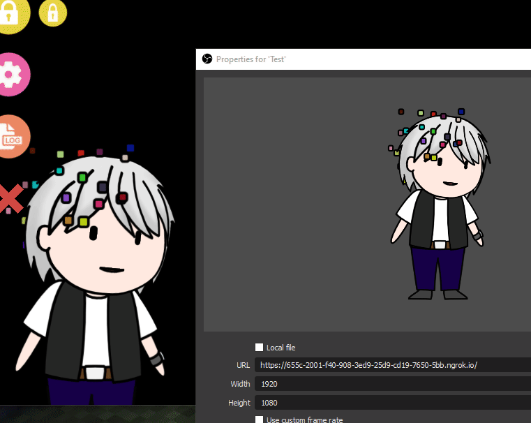

# Vtube Studio Web Relay

A relay to render Vtube Studio on web

## How to use
1. Launch the app
2. Select the path to Vtube Studio Live2dModels, usually at `C:\Program Files (x86)\Steam\steamapps\common\VTube Studio\VTube Studio_Data\StreamingAssets\Live2DModels` for windows
3. Connect to Vtube Studio
4. Access the webpage

## Credits
- https://github.com/DenchiSoft/VTubeStudio
- https://github.com/Hawkbat/VTubeStudioJS
- https://github.com/suppayami/pixijs-live2d
